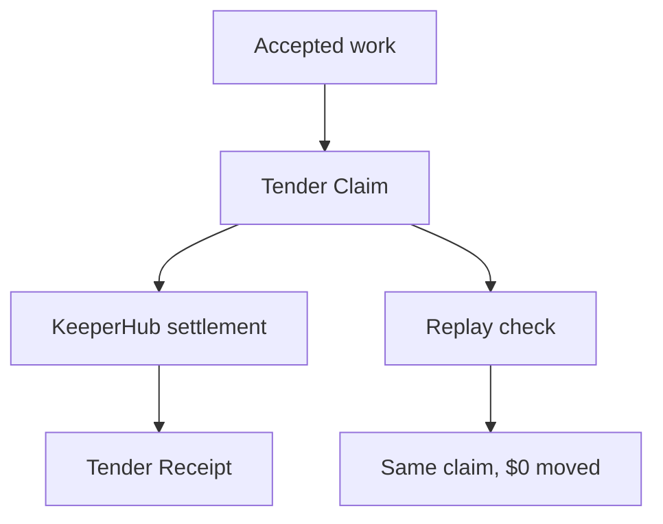

# Tender

No bounty. No race. Accepted work becomes a claim.

Tender is settlement infrastructure for accepted software contributions. GitHub proves what work was accepted. Tender determines what is economically owed. KeeperHub proves it was settled.



## Core Invariant

One accepted obligation -> one settlement.

## Primitive

A Tender Claim is an immutable economic identity created from an accepted contribution and its settlement policy.

It binds repository, task/contribution identity, acceptance evidence, accepted-work identity, policy version, recipient(s), asset, and amount.

## Signature Artifact

The Tender Receipt records the accepted contribution, claim ID, policy version, recipient(s), value, KeeperHub execution, transaction proof, and settlement status.

## Replay Proof

The Settlement Replay Harness currently reports:

```text
10 settlement scenarios replayed · 0 duplicate payouts
```

Generated evidence: `evidence/settlement-replay-harness.json`.

## KeeperHub

Manual calibration already succeeded on Base Sepolia:

- Workflow: `Tender -- Settle Claim`
- Workflow ID: `yy4ml6aevkov3zaulkpx15`
- Amount: `0.01 USDC`
- Transaction: `0x2116cfde5ba32647c481aff669326dd18e2d736aeb68bab86ed4aa1d9a7069e0`

This is calibration evidence only. The canonical hero proof must be Tender-caused through the GitHub Actions live-proof path.

## GitHub Actions Live Proof

Run `Tender Live Proof` manually with:

- recipient wallet
- minimal USDC amount
- optional accepted work ID
- optional task ID

The action uses repository secrets:

- `KEEPERHUB_API_KEY`
- `KEEPERHUB_BASE_URL`
- `KEEPERHUB_WORKFLOW_ID`

It writes `evidence/live-proof.json` as an artifact without printing secrets.

## Run Locally

```bash
npm install
npm run build
npm start
```

Open `http://localhost:8787`.

## Verify

```bash
npm run verify
```

This runs build, unit tests, and the replay harness.

## Current Limitations

- Local mock mode is not live proof.
- The current KeeperHub workflow was calibrated with static values and must continue migrating toward claim-driven input.
- Production deployment is still pending.
