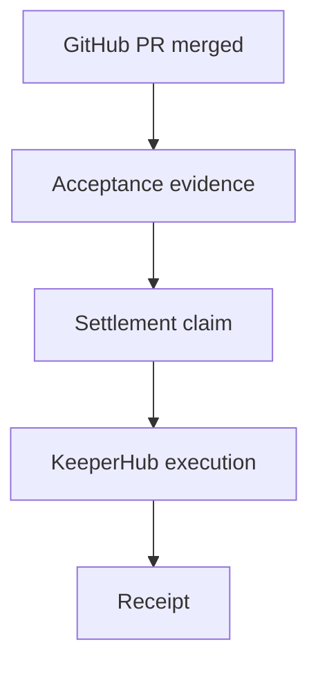

# Tender

Accepted work becomes a settled obligation.

Tender is a contribution settlement protocol. It watches accepted contribution evidence, creates a deterministic settlement claim, executes through KeeperHub, and records a receipt exactly once.



## Problem

Open-source work acceptance and contributor payout usually live in separate systems. That creates manual coordination, payout delays, duplicate payout risk, weak auditability, and ambiguity over which event actually created the obligation.

## What Tender Does

- Converts accepted contribution evidence into a settlement claim.
- Uses deterministic settlement identity for replay safety.
- Executes settlement through KeeperHub.
- Records KeeperHub execution and transaction receipt.
- Explains why money moved or why it did not.

## Exactly-Once Settlement

Tender derives settlement identity from source, repository, issue, PR, merge SHA, recipient, token, chain, and amount. Webhook delivery IDs are not part of the identity, so duplicate events map to the same claim.

## KeeperHub Integration

Production mode uses KeeperHub REST workflow execution:

- `GET /api/keys` to verify the API key.
- `POST /api/workflows/{workflowId}/execute` to start execution.
- `GET /api/workflows/executions/{executionId}/wait` to collect status and transaction hashes.
- `Idempotency-Key` derived from the settlement ID.

## Run Locally

```bash
npm install
npm run build
npm start
```

Open `http://localhost:8787`.

## Tests

```bash
npm test
```

Covered cases:

- settlement ID determinism
- duplicate event handling
- accepted vs non-accepted contribution
- invalid recipient wallet
- failed KeeperHub execution
- retry identity
- successful receipt reconciliation
- forged webhook evidence

## Environment

Copy `.env.example` to `.env` and configure:

- `GITHUB_WEBHOOK_SECRET`
- `KEEPERHUB_API_KEY`
- `KEEPERHUB_WORKFLOW_ID`
- `KEEPERHUB_MODE=workflow`

Use `KEEPERHUB_MODE=mock` only for local UI and tests.

