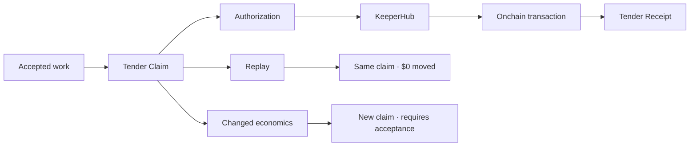

# Tender

> **Accepted once. Owed once. Settled once.**

**Tender is an economic clearing layer for accepted software work.**  
It turns acceptance into one deterministic obligation, delegates value movement to KeeperHub, and preserves a receipt that survives retries, callbacks, and replay.

**Live product:** https://tender-settlement.faadil-casecraft.workers.dev  
**Canonical KeeperHub transaction:** https://sepolia.basescan.org/tx/0x269f77504e421e16ee3193de5bb5c56a55618a4fc210f5ccba2dabf73d18e5db  
**Tests:** 42/42 passing · **Replay harness:** 12 scenarios · **Duplicate payouts:** 0

---

## The 30-second proof

A valid event can be delivered twice without representing a new economic fact.

Tender gives accepted work a deterministic economic identity:

```text
accepted work
    ↓
Tender Claim
    ↓
KeeperHub execution
    ↓
Tender Receipt
```

Replay the same accepted work:

```text
same claim
Δ KeeperHub executions = 0
Δ additional movement  = $0.00

→ SAME CLAIM
→ NO SECOND PAYMENT
```

Change the economics:

```text
amount / recipient / policy changes
    ↓
different Tender Claim
    ↓
REQUIRES_ACCEPTANCE
    ↓
$0 moved
```

That distinction — **retry versus new economic obligation** — is the product.

---

## Why this exists

Retries are normal. Duplicate economic effects are not.

A 2025 production Stripe-webhook postmortem documented a retried payment event being processed more than once, with duplicate credits across 18 accounts, two unintended subscription downgrades, and $1,247 in duplicate credits later reversed.

Tender's design rule is:

> **Authenticity is not economic uniqueness. A repeated delivery is not a new economic fact.**

The full negative-evidence record and source are in [`docs/reliability/NEGATIVE-EVIDENCE.md`](docs/reliability/NEGATIVE-EVIDENCE.md).

---

## Why KeeperHub

Tender deliberately does **not** rebuild transaction execution.

| Layer | Responsibility |
| --- | --- |
| Source adapter | Proves what work was accepted |
| **Tender** | Decides whether acceptance creates a new economic obligation |
| **KeeperHub** | Executes the authorized value movement |
| Tender Receipt | Preserves the causal settlement record |
| Independent verifier | Confirms the transaction onchain |

KeeperHub gives Tender the execution layer that should stay deterministic: workflow simulation, transaction execution, retry discipline, execution identity, and auditability.

Tender adds the layer above execution:

> **Does this accepted work represent a new obligation at all?**

---

## Canonical execution proof

The checked-in proof is a real Base Sepolia settlement executed through KeeperHub.

| Evidence | Value |
| --- | --- |
| Accepted work | `3c19bd869e9223bdb1d353a864f1818ee6c2e871` |
| Tender Claim | `tclaim_94eb021e7894252897176543cc9d7b49` |
| Tender Receipt | `treceipt_94eb021e7894252897176543cc9d7b49` |
| KeeperHub execution | `7k14qt2a1989rrc5r370d` |
| Amount | `0.01 USDC` |
| Network | Base Sepolia |
| Replay | `ALREADY_SETTLED` |
| Extra KeeperHub executions | `0` |
| Extra movement | `$0` |

Machine-readable proof: [`evidence/live-proof.json`](evidence/live-proof.json)

---

## Live-project integration: Valid Until

The Agent Economy brief rewards KeeperHub integrations into a named live project, not generic wrappers.

Tender now includes a project-specific binding for **[Valid Until](https://valid-until-agent-os.pages.dev)**, a deployed agent-safety product.

Bound accepted work:

- Repository: [`Faadil1/valid-until-agent-os`](https://github.com/Faadil1/valid-until-agent-os)
- Accepted work: [`aeec4ed`](https://github.com/Faadil1/valid-until-agent-os/commit/aeec4ed165eb0917688a885b960175d58f729692)
- Change: **Bind exact action into execution validity contract**
- Integration code: [`src/integrations/validUntil.ts`](src/integrations/validUntil.ts)
- Regression tests: [`tests/validUntilIntegration.test.ts`](tests/validUntilIntegration.test.ts)

The integration proves that Tender's economic identity is stable across delivery/event retries and changes when the accepted work's economics change.

**Truth boundary:** the dedicated Valid Until value-moving settlement is guarded behind an explicit approval workflow and is not represented as completed until that distinct KeeperHub transaction actually exists.

---

## Reliability is part of the product

Tender's evidence is intentionally not “all green.”

It retains and tests negative paths:

| Condition | Tender response |
| --- | --- |
| Work not accepted | `NOT_ACCEPTED` |
| Required checks incomplete | `ACCEPTANCE_INCOMPLETE` |
| Malformed recipient | `BLOCKED` |
| Changed economics | `REQUIRES_ACCEPTANCE` |
| Forged corrective authorization | rejected |
| Unconfirmed KeeperHub result | reconcile same claim; do not rebroadcast |
| Callback interruption after broadcast | reconcile; do not rebroadcast |
| Proof service unavailable | `UNVERIFIED` |
| Replay cannot complete | no positive verdict is shown |

**Real failure > fake success.**  
If Tender cannot prove something, it says so.

Replay evidence: [`evidence/settlement-replay-harness.json`](evidence/settlement-replay-harness.json)

---

## Product surfaces

- `/` — compressed product thesis + concrete negative evidence
- `/obligation` — why value became owed
- `/proof` — recomputation, independent chain verification, replay
- `/lab` — changed economics versus replay
- `/receipt` — shareable settlement artifact

The public product is proof-safe and contains no KeeperHub broadcast credential.

---

## Architecture



Detailed architecture: [`docs/product/ARCHITECTURE.md`](docs/product/ARCHITECTURE.md)

---

## Run it

Requires Node.js 24+.

```bash
git clone https://github.com/Faadil1/tender.git
cd tender
npm ci
npm run verify
npm start
```

Open `http://localhost:8787`.

`npm run verify` runs:

1. TypeScript build
2. unit/integration tests
3. the 12-scenario settlement replay harness

No real value movement occurs during `npm run verify`.

---

## KeeperHub execution path

The canonical workflow is:

```text
Tender Claim
→ KeeperHub workflow preflight
→ explicit authorized execution
→ executionId persisted
→ transaction confirmation/reconciliation
→ Tender Receipt
```

The value-moving proof workflow is manual and intentionally separated from normal CI.

The **Tender × Valid Until** workflow adds an explicit typed approval input before it can broadcast anything.

See [`docs/keeperhub/INTEGRATION.md`](docs/keeperhub/INTEGRATION.md).

---

## Repository map

```text
src/
  adapters/       source + KeeperHub adapters
  domain/         claim identity, settlement engine, validation
  integrations/   named live-project bindings
  cloudflare/     public/operator runtime
  server/         local runtime

tests/            deterministic regression suite
evidence/         canonical machine-readable proof
policy/           settlement policy artifacts
public/           judge-facing product
docs/             architecture, integration, reliability
.github/workflows guarded CI / proof workflows
```

No design research, competitive intelligence, LLM-review packets, or private handoff state are part of the judge-facing tree.

---

## What is intentionally unfinished

- The canonical KeeperHub execution proof is complete and frozen.
- The **Valid Until-specific settlement binding is implemented and tested**, but its dedicated real KeeperHub transfer is not claimed as complete until an explicitly approved transaction is executed.
- The public runtime remains non-value-moving by design.

That boundary is intentional: Tender does not turn “almost verified” into “verified.”

---

## Submission

Judge-facing submission facts and links: [`SUBMISSION.md`](SUBMISSION.md)

Deployment and post-deploy checks: [`DEPLOYMENT.md`](DEPLOYMENT.md)

Contributing / verification workflow: [`CONTRIBUTING.md`](CONTRIBUTING.md)
