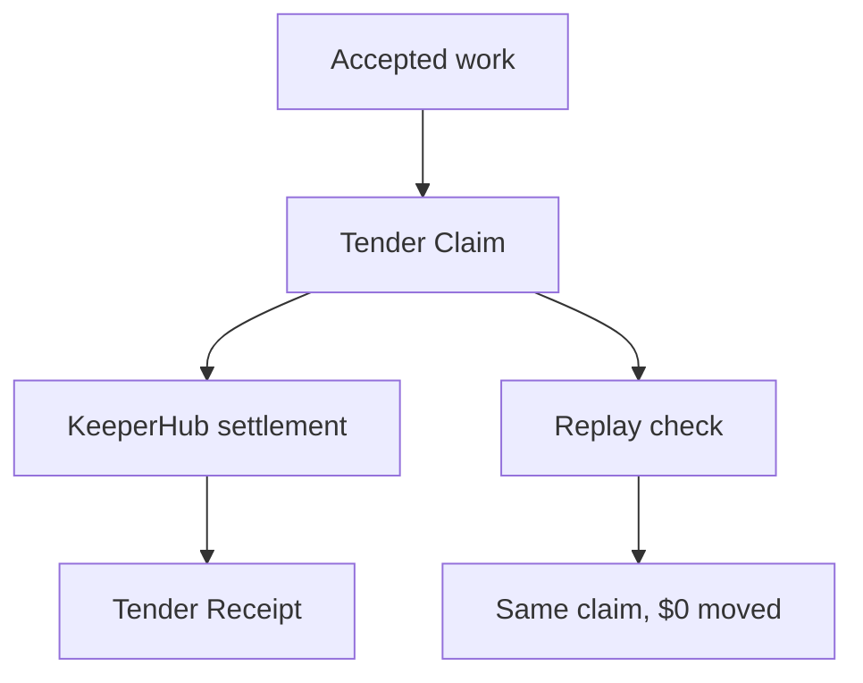

# Tender

No bounty. No race. Accepted work becomes a claim.

Tender is settlement infrastructure for accepted software contributions. GitHub proves what work was accepted. Tender determines what is economically owed. KeeperHub proves it was settled.



## Core Invariant

One accepted obligation -> one settlement.

## Primitive

A Tender Claim is an immutable economic identity created from accepted contribution evidence and settlement policy.

It binds repository, task/contribution identity, acceptance kind, accepted-work identity, policy version, recipient(s), asset, chain, and amount. Delivery IDs, Action run IDs, and retry IDs are deliberately excluded from economic identity.

## Signature Artifact

A Tender Receipt records the accepted contribution, claim ID, policy version, recipient(s), value, KeeperHub execution, transaction proof, and settlement status.

## Measured Reliability Proof

The Settlement Replay Harness reports:

```text
12 settlement scenarios replayed · 0 duplicate payouts
```

Unit verification currently passes `39/39` tests.

Evidence: `evidence/settlement-replay-harness.json`.

## Canonical Live Proof

A Tender-caused GitHub Actions run settled a real `0.01 USDC` Base Sepolia transfer through KeeperHub, issued a Tender Receipt, then replayed the same Tender Claim without a second KeeperHub execution.

- GitHub Actions run: `35162003096`
- Accepted work: `3c19bd869e9223bdb1d353a864f1818ee6c2e871`
- Tender Claim: `tclaim_94eb021e7894252897176543cc9d7b49`
- Tender Receipt: `treceipt_94eb021e7894252897176543cc9d7b49`
- KeeperHub execution: `7k14qt2a1989rrc5r370d`
- Transaction: `0x269f77504e421e16ee3193de5bb5c56a55618a4fc210f5ccba2dabf73d18e5db`
- Replay: `ALREADY_SETTLED`
- Additional KeeperHub executions: `0`
- Additional movement: `$0`

Evidence: `evidence/live-proof.json`.

BaseScan:
`https://sepolia.basescan.org/tx/0x269f77504e421e16ee3193de5bb5c56a55618a4fc210f5ccba2dabf73d18e5db`

## KeeperHub Integration

Configured execution path:

- Workflow: `Tender: Settle Claim`
- Workflow ID: `yy4ml6aevkov3zaukpx15`
- Network: Base Sepolia (`84532`)
- Asset: USDC
- Trigger inputs: `recipient`, `amount`
- Transfer bindings: `Manual.data.recipient`, `Manual.data.amount`

Before the canonical run, Tender verified API-key scope, workflow visibility, dynamic input bindings, KeeperHub workflow preflight, and an equivalent ERC20 dry-run with `success: true` and `wouldRevert: false`.

The earlier manual calibration transaction remains separate calibration evidence in `evidence/keeperhub-calibration.json`.

## GitHub Actions

- `Tender Preflight Diagnostic` is read-only and performs no value-moving broadcast.
- `Tender Live Proof` is the value-moving proof path and should not be re-run casually now that canonical evidence exists.

Repository secrets:

- `KEEPERHUB_API_KEY`
- `KEEPERHUB_BASE_URL`
- `KEEPERHUB_WORKFLOW_ID`

## Run Locally

```bash
npm install
npm run build
npm start
```

Open `http://localhost:8787`.

## Verify

```bash
npm run verify
```

This runs build, unit tests, and the replay harness.

## Current Status

Core product proof and judge-facing deployment are complete. Remaining hackathon work is final mobile QA, judge-compressed video capture, and submission packaging.


## Concrete Negative Evidence

Tender's reliability thesis is grounded in a real production failure pattern, not only synthetic tests.

A 2025 TanStack Ship production postmortem reports a retried payment webhook being processed twice, resulting in duplicate credits for 18 accounts, unintended downgrades for 2 accounts, and $1,247 in duplicate credits that had to be reversed.

Tender's design implication:

> A repeated delivery is not a new economic fact.

Evidence and source notes:

`docs/NEGATIVE-EVIDENCE.md`

Tender also keeps negative paths in its own evidence record instead of hiding them: not accepted, failed checks, malformed recipient, changed economics requiring acceptance, forged authorization, unconfirmed settlement, and post-broadcast reconciliation.

## Judge Compression

Canonical gate:

`docs/JUDGE-COMPRESSION-GATE.md`

Final demo target:

- <=15s: problem + Tender invariant + Proof action begins
- 30–45s: replay verdict + zero deltas + chain/receipt evidence + counter-case
- <=3m: complete Problem -> Solution -> Demo -> Why Us narrative

Production:

`https://tender-settlement.faadil-casecraft.workers.dev`
