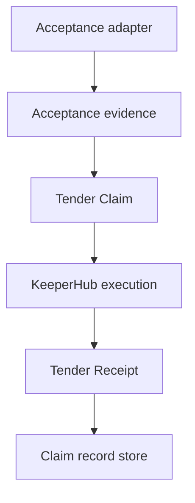

# Architecture

## Domain Center

Tender is centered on domain concepts:

- `Contribution`
- `AcceptanceEvidence`
- `SettlementPolicy`
- `TenderClaim`
- `SettlementExecution`
- `TenderReceipt`

GitHub is the first acceptance adapter. KeeperHub is the first settlement execution adapter.

## Tender Claim Identity

The Tender Claim ID is derived from:

- source
- repository
- task/contribution identifier
- acceptance kind
- accepted-work identity
- policy version
- recipient set
- token
- chain
- amount

Webhook delivery IDs, GitHub Action run IDs, and retry IDs are deliberately excluded. Duplicate delivery, rerun, concurrency, or callback retry must converge on the same Tender Claim.

## Exactly-Once Guardrails

- In-process claim lock prevents concurrent workers from double executing.
- Existing `SETTLED` or `ALREADY_SETTLED` records return replay proof instead of re-execution.
- KeeperHub writes use the Tender Claim idempotency key.
- In-flight claims with a KeeperHub execution ID are reconciled before any rebroadcast.
- In-flight claims without an execution ID fail closed rather than broadcasting blindly.
- The canonical live-proof path snapshots the successful settlement before replay and rejects any replay that creates another KeeperHub execution.

## KeeperHub Integration

Configured production path:

- `KEEPERHUB_BASE_URL=https://app.keeperhub.com`
- `KEEPERHUB_WORKFLOW_ID=yy4ml6aevkov3zaukpx15`
- Workflow: `Tender: Settle Claim`
- Network: Base Sepolia (`84532`)
- Asset: USDC
- Required trigger inputs: `recipient`, `amount`
- Downstream bindings: `Manual.data.recipient`, `Manual.data.amount`

Tender owns acceptance, economic entitlement, deterministic claim identity, replay safety, and exactly-once semantics. KeeperHub owns wallet-backed execution and transaction proof.

## Preflight

Before value movement, the diagnostic path verifies:

1. KeeperHub API-key authentication.
2. Target workflow visibility.
3. Dynamic trigger schema and bindings.
4. Workflow simulation acceptance.
5. Equivalent ERC20 dry-run with `success: true` and `wouldRevert: false`.

The workflow-level simulation may skip a dynamically templated transfer before runtime inputs are resolved; the direct ERC20 simulation provides transaction-level dry-run evidence without signing or broadcasting.

## Canonical Live Execution

GitHub Actions run `35162003096` executed:

`accepted work -> Tender Claim -> KeeperHub -> Tender Receipt -> replay`

Canonical proof:

- Claim: `tclaim_94eb021e7894252897176543cc9d7b49`
- KeeperHub execution: `7k14qt2a1989rrc5r370d`
- Transaction: `0x269f77504e421e16ee3193de5bb5c56a55618a4fc210f5ccba2dabf73d18e5db`
- Settlement: `SETTLED`
- Replay: `ALREADY_SETTLED`
- Additional KeeperHub executions: `0`
- Additional movement: `$0`

Machine-readable evidence: `evidence/live-proof.json`.
