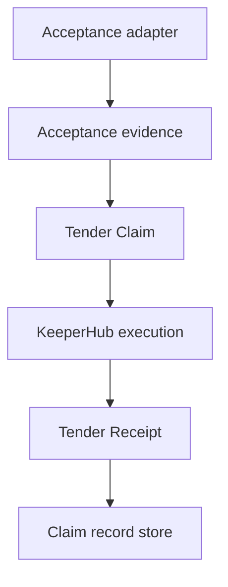

# Architecture

## Domain Center

Tender is centered on domain concepts:

- `Contribution`
- `AcceptanceEvidence`
- `SettlementPolicy`
- `TenderClaim`
- `SettlementExecution`
- `TenderReceipt`

GitHub is the first acceptance adapter. KeeperHub is the first settlement execution adapter.

## Tender Claim Identity

The Tender Claim ID is derived from:

- source
- repository
- task/contribution identifier
- acceptance kind
- accepted-work identity
- policy version
- recipient set
- token
- chain
- amount

Webhook delivery IDs, GitHub Action run IDs, and retry IDs are deliberately excluded. A duplicate webhook, rerun action, concurrent worker, or callback retry must converge on the same Tender Claim.

## Exactly-Once Guardrails

- In-process claim lock prevents concurrent workers from double executing.
- Existing `SETTLED` or `ALREADY_SETTLED` records return replay proof instead of re-execution.
- KeeperHub writes use the Tender Claim idempotency key.
- Reconciliation resumes existing claims after timeout/interruption.

## KeeperHub Integration

Configured production path:

- `KEEPERHUB_BASE_URL=https://app.keeperhub.com`
- `KEEPERHUB_WORKFLOW_ID=yy4ml6aevkov3zaulkpx15`
- Workflow: `Tender -- Settle Claim`
- Network: Base Sepolia
- Asset: USDC

The current KeeperHub workflow was manually calibrated with static values. The next live proof must be Tender-caused through GitHub Actions, with amount and recipient coming from the approved Tender Claim / workflow input path.
