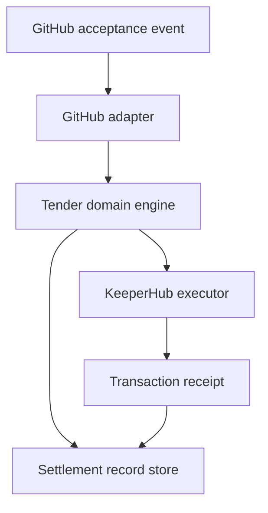

# Architecture

## Domain Center

The code is organized around Tender concepts rather than GitHub glue:

- `Contribution`
- `AcceptanceEvidence`
- `SettlementPolicy`
- `SettlementClaim`
- `SettlementExecution`
- `SettlementReceipt`

GitHub is the first acceptance adapter. KeeperHub is the first settlement execution adapter.

## Settlement Identity Invariant

The settlement ID is derived from:

- source
- repository
- issue/task identifier
- pull request identifier
- merge SHA
- recipient wallet
- token
- chain
- amount

Webhook delivery IDs are deliberately excluded. A duplicate webhook maps to the same settlement claim and cannot create a second economic effect.

## KeeperHub Integration

The production path uses:

- `GET /api/keys` for auth preflight.
- `POST /api/workflows/{workflowId}/execute` for execution.
- `GET /api/workflows/executions/{executionId}/wait` for receipt/reconciliation.
- `Idempotency-Key` header derived from the settlement ID.

Mock mode exists only for local UI and tests. It must not be presented as live transaction proof.

