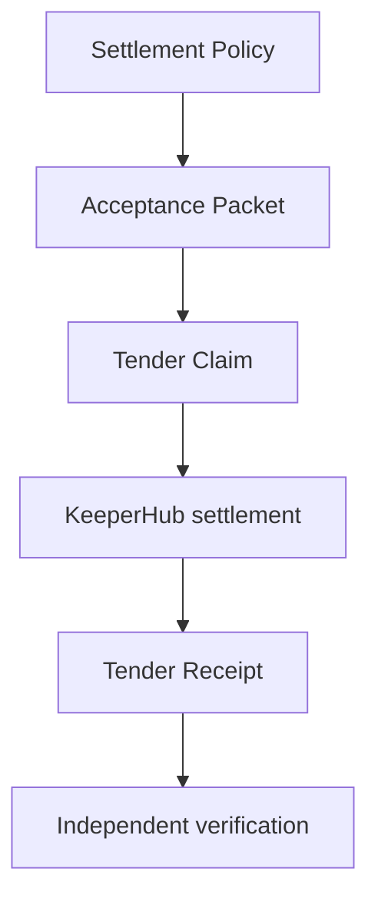

# Architecture

## Domain Center

Tender is centered on domain concepts, not GitHub glue:

- `SettlementPolicy`
- `AcceptanceEvidence` / Acceptance Packet
- `TenderClaim`
- `EconomicAuthorization`
- `SettlementExecution`
- `TenderReceipt`
- `SettlementRecord`

GitHub is the first acceptance adapter. KeeperHub is the first settlement execution adapter.

## Authority Zones

| Zone | Can Do | Cannot Do |
| --- | --- | --- |
| Operator runtime | create/version policies, authorize claims, settle through KeeperHub, reconcile, create corrective claims | rewrite settled receipts |
| Public judge runtime | recompute identity, replay canonical settled claim, inspect altered economics, verify chain receipt | broadcast KeeperHub payment or access KeeperHub secrets |
| Source adapter | prove what work was accepted | decide settlement identity |
| KeeperHub | execute settlement | decide whether accepted work is owed |

## Tender Claim Identity

The Tender Claim ID is derived from:

- source
- repository
- task/contribution identifier
- acceptance kind
- accepted-work identity
- policy version and optional policy digest
- recipient set
- token
- chain
- normalized amount

Webhook delivery IDs, GitHub Action run IDs, retry IDs, and callback IDs are deliberately excluded. Duplicate delivery, rerun, concurrency, and callback retry converge on the same Tender Claim.

## Changed Economics

If a settled accepted-work identity already has a Tender Receipt, a changed amount, recipient, accepted work, or policy creates a new claim with `REQUIRES_ACCEPTANCE`. No KeeperHub call is made. A new value-moving path requires explicit `EconomicAuthorization` as a corrective claim linked to the original claim.

## Exactly-Once Guardrails

- In-process claim lock prevents concurrent workers from double executing.
- Existing `SETTLED` or `ALREADY_SETTLED` records return replay proof instead of re-execution.
- Changed economics after settlement produce `REQUIRES_ACCEPTANCE`, not an automatic payment.
- KeeperHub writes use the Tender Claim idempotency key.
- In-flight claims with a KeeperHub execution ID reconcile before any rebroadcast.
- In-flight claims without an execution ID fail closed.
- Settled receipts are immutable; corrections become linked obligations.

## Canonical Live Execution

GitHub Actions run `35162003096` executed:

`accepted work -> Tender Claim -> KeeperHub -> Tender Receipt -> replay`

Canonical proof:

- Claim: `tclaim_94eb021e7894252897176543cc9d7b49`
- KeeperHub execution: `7k14qt2a1989rrc5r370d`
- Transaction: `0x269f77504e421e16ee3193de5bb5c56a55618a4fc210f5ccba2dabf73d18e5db`
- Settlement: `SETTLED`
- Replay: `ALREADY_SETTLED`
- Additional KeeperHub executions: `0`
- Additional movement: `$0`

Machine-readable evidence: `evidence/live-proof.json`.
